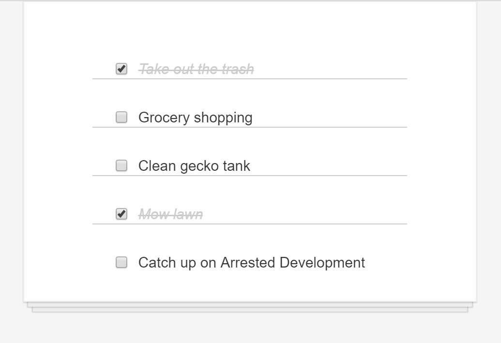

# todolist-reactjs

A simple To-Do list using React JS.

I am learning "ReactJS" from [Scrimba](https://scrimba.com/), it's a wonderful platform to learn and execute at same time. All the mentors are wonderful!



Currently this is reading from a JSON written in JS. You can easily add data from an API to complete.

Happy Learning!

## Scripts
npm & NodeJS is required for this project!

```
cd todolist-reactjs
```
Once in your project folder, run following
```
npm install
```
this will automatically install all the dependencies and then you can use to following commands to run the project.

In the project directory, you can run:
```
npm start
```
Runs the app in the development mode.

> Open http://localhost:3000 to view it in the browser.

The page will reload if you make edits.
You will also see any lint errors in the console.
```
npm test
```
Launches the test runner in the interactive watch mode.
See the section about running tests for more information.
```
npm run build
```
Builds the app for production to the build folder.
It correctly bundles React in production mode and optimizes the build for the best performance.

The build is minified and the filenames include the hashes.
Your app is ready to be deployed!

See the section about deployment for more information.
```
npm run eject
```
Note: this is a one-way operation. Once you eject, you can’t go back!

If you aren’t satisfied with the build tool and configuration choices, you can eject at any time. This command will remove the single build dependency from your project.

Instead, it will copy all the configuration files and the transitive dependencies (Webpack, Babel, ESLint, etc) right into your project so you have full control over them. All of the commands except eject will still work, but they will point to the copied scripts so you can tweak them. At this point you’re on your own.

You don’t have to ever use eject. The curated feature set is suitable for small and middle deployments, and you shouldn’t feel obligated to use this feature. However we understand that this tool wouldn’t be useful if you couldn’t customize it when you are ready for it.


## Next

1. Going to "add new item" functionlaity.

## License
License: none (public domain)

## Acknowledgments

This project was bootstrapped with [Create React App.](https://github.com/facebook/create-react-app) 
